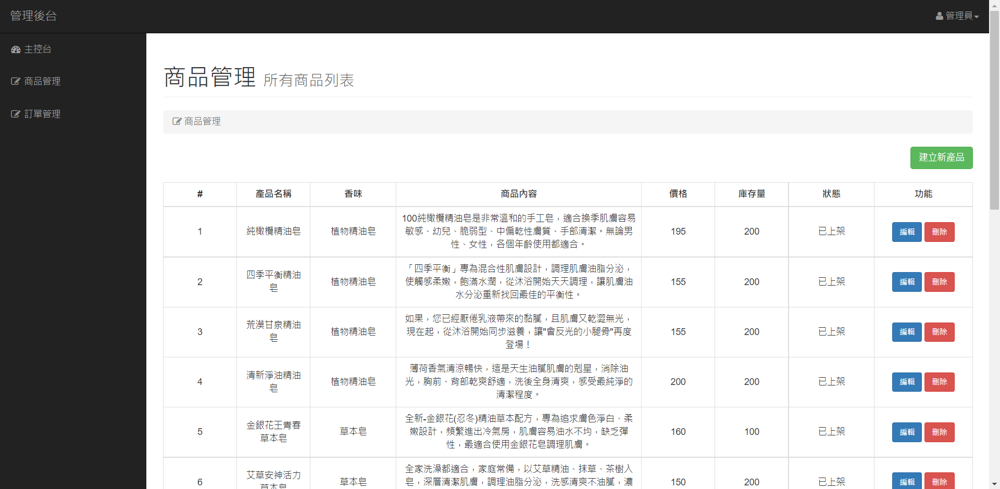

# 系統畫面

## ◆首頁
- 產品及活動圖片幻燈片、熱銷產品、會員註冊與登入
  

## ◆產品瀏覽
- 所有餐點之瀏覽，顯示價錢及餐點種類
  

## ◆個別產品頁面(加入購物車頁面)
- 加入購物車之頁面，可選擇產品數量
  

## ◆購物車
- 欲訂購之產品會先加入至購物車內，並顯示小計與總計
  

## ◆會員歷史訂單查詢
- 可查詢該會員的歷史訂單
  

## ◆會員歷史訂單明細查詢
- 可查詢該會員的歷史訂單明細
  

## ◆會員個人資料修改
- 提供會員修改個人資料
  

## ◆後台產品管理
- 查看所有產品，可新增產品
  

## ◆後台訂單管理
- 查看所有訂單，包含已完成及準備中之訂單
  

## 系統名稱及作用

HS SHOP

- 顧客可以選擇商品、數量進行購買
- 顧客在確認產品無誤後，可以按下加入購物車
- 顧客可察看購物車內容、結帳
- 顧客可察看訂單資訊
- 管理者可以上、下架產品
- 管理者可以編輯、新增、刪除產品

## 系統的主要功能
★ 前台
- 首頁 (Route::get('/',[\App\Http\Controllers\HomeController::class,'index'])->name('home');) [3A832046 陳靖綾](https://github.com/3A832046)
- 產品瀏覽 (Route::get('/product/index',[\App\Http\Controllers\ProductController::class,'index'])->name('product.index');) [3A832046 陳靖綾](https://github.com/3A832046)
- 個別產品資訊 (Route::get('/product/index/detail/{id}',[\App\Http\Controllers\ProductController::class,'show'])->name('product.detail');) [3A832046 陳靖綾](https://github.com/3A832046)
- 購物車 (Route::get('/cart/index',[\App\Http\Controllers\CartController::class,'index'])->name('cart.index');) [3A832046 陳靖綾](https://github.com/3A832046)
- 訂單查詢 (Route::get('/order/history',[\App\Http\Controllers\OrderController::class,'index'])->name('order.history');) [3A832046 陳靖綾](https://github.com/3A832046)

★ 後台
- 產品管理 (Route::get('products',[AdminController::class,'index'])->name('admin.products.index');) [3A832005 李晏慈](https://github.com/3A832005)
- 訂單管理 (Route::get('orders',[AdminOrderController::class,'index'])->name('admin.orders.index');) [3A832005 李晏慈](https://github.com/3A832005)

## ERD
  

## 關聯式綱要圖
  

## 實際資料表欄位設計

- 會員 (users)資料表
  

- 產品 (product)資料表
  

- 購物車 (carts)資料表
  

- 訂單 (order)資料表
  

- 項目 (items)資料表
  

## 初始專案與DB負責的同學

- 初始專案 [3A832005 李晏慈](https://github.com/3A832005)
- DB [3A832005 李晏慈](https://github.com/3A832005)、[3A832046 陳靖綾](https://github.com/3A832046)

## 額外使用的套件或樣板

- 前台樣板：[Heroic Features](https://startbootstrap.com/template/heroic-features)

        作為前台頁面使用，畫面簡單乾淨

- 後台樣板：[Sidebar](https://startbootstrap.com/template/simple-sidebar)

        作為後台管理使用，介面清楚明瞭，方便操作

## 系統測試資料存放位置

     final03底下的sql資料夾

## 系統使用者測試帳號

★ 前台

     帳號：aaa@gmail.com
     密碼：123456ab

★ 後台

     帳號：admin@gmail.com
     密碼：admin123

## 系統開發人員與工作分配

[3A832005 李晏慈](https://github.com/3A832005)

    後台管理
    初始專案
    DB
    登入後判斷身分別進入前台或後台
    登入頁面修改
    會員資料頁面修改
    期中報告製作

[3A832046 陳靖綾](https://github.com/3A832046)

    前台管理
    DB
    readme 撰寫
    註冊頁面修改
    前台購物車及訂單查詢
    期中報告製作
        
